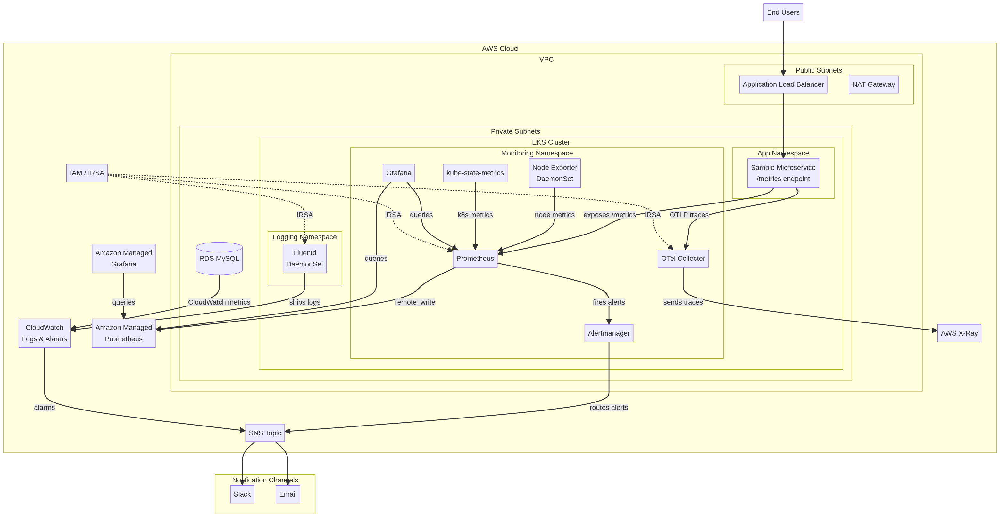

# Scalable Observability Stack on AWS using Prometheus and Grafana

This project provides a comprehensive, production-style observability platform on AWS. It is designed to collect, store, visualize, and alert on metrics from your infrastructure, containers, and applications. The platform is built using a combination of open-source tools and AWS managed services, providing a flexible and scalable solution for monitoring modern cloud-native applications.

## Business Problem

In today's competitive digital landscape, maintaining high levels of application performance and reliability is crucial for business success. Modern microservices architectures, while offering scalability and flexibility, also introduce significant operational complexity. Without a robust observability solution, engineering teams struggle to:

*   **Proactively identify and resolve performance bottlenecks** before they impact users.
*   **Quickly troubleshoot and diagnose issues** in a distributed environment.
*   **Ensure compliance with Service Level Agreements (SLAs)** and maintain user trust.
*   **Optimize resource utilization and control operational costs**.

This project addresses these challenges by providing a centralized and scalable observability platform that offers deep insights into the health and performance of the entire application stack.

## Architecture

The platform is built on a foundation of Amazon Web Services (AWS) and leverages a combination of self-managed and AWS-managed services to provide a flexible and cost-effective solution. The architecture is designed to be highly available and scalable, ensuring that the observability platform can grow with your application needs.



### Components

*   **Amazon EKS:** A managed Kubernetes service that provides the container orchestration layer for the platform.
*   **Prometheus:** An open-source monitoring and alerting toolkit that collects metrics from various sources.
*   **Grafana:** A leading open-source platform for monitoring and observability, used for visualizing metrics and creating dashboards.
*   **Alertmanager:** Handles alerts sent by client applications such as the Prometheus server.
*   **Amazon Managed Service for Prometheus (AMP):** A fully managed Prometheus-compatible monitoring service that makes it easy to monitor containerized applications at scale.
*   **Amazon Managed Grafana (AMG):** A fully managed Grafana service that simplifies the process of creating, managing, and sharing dashboards.
*   **AWS X-Ray:** A distributed tracing service that helps developers analyze and debug production, distributed applications.
*   **Amazon CloudWatch:** A monitoring and observability service that provides data and actionable insights to monitor your applications, respond to system-wide performance changes, optimize resource utilization, and get a unified view of operational health.

## Monitoring Strategy

The platform is designed to provide a holistic view of your application's health and performance by collecting metrics from all layers of the stack.

| Layer | Metrics | Tools |
|---|---|---|
| **Infrastructure** | CPU & memory usage, disk I/O, network traffic | `node_exporter`, `kube-state-metrics` |
| **Kubernetes** | Pod health, restart count, resource limits vs usage, deployment status | `kube-state-metrics` |
| **Application** | HTTP request rate, error rate (5xx), latency (p95, p99), throughput | Custom Prometheus client libraries |
| **Database** | RDS CPU usage, connections count, read/write latency | CloudWatch exporter or AMP integration |

## Alerting Strategy

The platform includes a comprehensive alerting strategy to ensure that you are notified of critical issues in a timely manner. Alerts are defined in Prometheus and sent to Alertmanager, which then routes them to the appropriate notification channels.

### Sample Alerts

*   **High CPU Usage:** `High CPU > 80% for 5 minutes`
*   **Pod CrashLoopBackOff:** `Pod is in a CrashLoopBackOff state`
*   **High Error Rate:** `HTTP 5xx error rate > 5%`
*   **High Latency:** `p95 latency > 500ms`
*   **RDS Connections:** `RDS connections near limit`

### Notification Channels

*   **Slack**
*   **Email**
*   **Amazon SNS**

## Security Model

Security is a top priority in this project. The platform is designed with a multi-layered security approach to protect your data and infrastructure.

*   **IAM Roles for Service Accounts (IRSA):** Provides fine-grained access control for Kubernetes service accounts.
*   **Private Subnets:** All critical components are deployed in private subnets to minimize exposure to the public internet.
*   **Security Groups:** Network traffic is restricted using security groups to ensure that only authorized traffic is allowed.
*   **TLS Encryption:** Communication between Prometheus and Grafana is encrypted using TLS to protect data in transit.

## Cost Estimation

This project can be deployed in two different configurations to accommodate different budget and production requirements.

| Component | Budget Lab Version | Production Version |
|---|---|---|
| **Prometheus** | Self-managed on EKS | Amazon Managed Prometheus |
| **Grafana** | Self-hosted on EC2 | Amazon Managed Grafana |
| **EKS** | Minimal nodes | Multi-AZ EKS |
| **Architecture** | Single AZ | High Availability (HA) |

## Getting Started

To get started with this project, you will need to have an AWS account and the following tools installed:

*   **Terraform:** An infrastructure as code tool that allows you to build, change, and version infrastructure safely and efficiently.
*   **kubectl:** A command-line tool for controlling Kubernetes clusters.
*   **Docker:** A platform for developing, shipping, and running applications in containers.

### Deployment

1.  **Clone the repository:**

    ```bash
    git clone https://github.com/your-username/observability-platform.git
    cd observability-platform
    ```

2.  **Configure the environment:**

    Update the `terraform/environments/dev/terraform.tfvars` file with your specific settings.

3.  **Deploy the infrastructure:**

    ```bash
    cd terraform/environments/dev
    terraform init
    terraform apply
    ```

4.  **Deploy the Kubernetes manifests:**

    ```bash
    cd ../../../kubernetes
    kubectl apply -f .
    ```

## Deliverables

This project includes the following deliverables:

*   **Architecture Diagram:** A visual representation of the platform architecture.
*   **Terraform Code:** Infrastructure as code for deploying the platform on AWS.
*   **Kubernetes Manifests:** Kubernetes manifests for deploying the monitoring components.
*   **README:** A comprehensive guide to the project, including the business problem, architecture, monitoring strategy, alerting logic, security model, and cost estimation.

## References

*   [Prometheus Documentation](https://prometheus.io/docs/)
*   [Grafana Documentation](https://grafana.com/docs/)
*   [Amazon EKS Documentation](https://docs.aws.amazon.com/eks/)
*   [Amazon Managed Service for Prometheus Documentation](https://docs.aws.amazon.com/prometheus/)
*   [Amazon Managed Grafana Documentation](https://docs.aws.amazon.com/grafana/)
